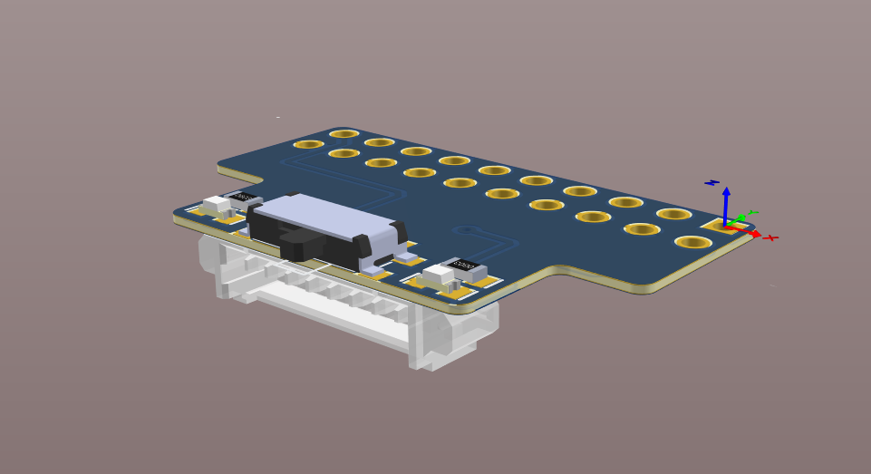
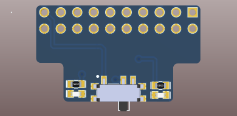
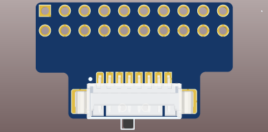

# J-Link 40-Pin to 8-Pin PicoBlade Adapter Board

This repository contains the hardware design files for a compact adapter board intended to be soldered directly to the bottom of the J-Link 40-pin JTAG connector.  
The board converts the large 40-pin header into a single 8-pin PicoBlade connector, providing a low-profile, robust interface for connecting custom target devices.

## Features

- 8-Pin PicoBlade JTAG Output: board converts the standard J-Link 40-pin JTAG connector into a compact 8-pin PicoBlade interface.  
- Optional 5 V Target Power: board includes an SMD slide switch that can route the J-Link 5 V supply to one of the PicoBlade pins, so it can be used to power a small target device directly from the debugger.
- Status LEDs: VRef LED indicates the presence of the target reference voltage and 5 V LED indicates when the slide switch enables the 5 V supply.

## Board Views

### Top View

### Bottom View

## Installation and Usage

1. Solder the adapter directly underneath the J-Link 40-pin connector, ensuring proper pin alignment.  
2. Use the 8-pin PicoBlade as the primary JTAG output to the target hardware.  
3. Enable the slide switch if you need to supply 5 V to the target through the PicoBlade connector.  
4. Use the onboard LEDs to verify presence of VRef and the state of the switched 5 V rail.

## Component library
Project is based on [AD_lib](https://github.com/a-styuf/AD_lib) Altium component library.

